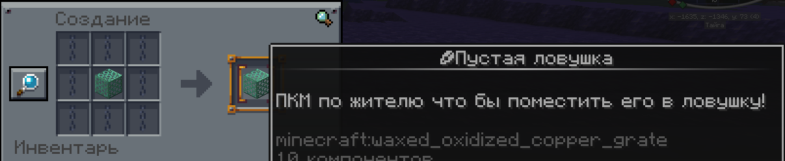

# 📦 Клетка для жителей

#### **⚒️ Крафт:**

Чтобы создать клетку, вам понадобится:

* **🔗 8 цепей** (по периметру)
* **🧱 1 окисленная медная решетка** (в центре)

**📜 Рецепт:** 

<figure><figcaption></figcaption></figure>

***

#### **🖱️ Использование:**

**🔐 Заточение жителя:**

1. Возьмите клетку в руку.
2. Подойдите к жителю и **нажмите ПКМ** — он окажется внутри!
3. **Профессия и все торговые предложения остаются**— теперь можно удобно перемещать жителей с нужными торгами!

**🚶 Перемещение:**

* Клетку с пленником можно **носить в инвентаре**.

**🔓 Освобождение:**

* Установив клетку вы **освободите жителя**.

***

#### **⚠️ Важно:**

* Все **профессии и торговые предложения остаются** при заточении.
* Клетку можно **использовать бесконечно** — просто ловите нового жителя!
