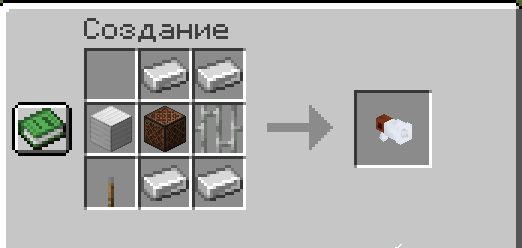

# 📢 Громкоговоритель


Для работы необходим мод **Simple Voice Chat** на клиенте.


***

### Крафт

<figure><figcaption></figcaption></figure>

***

### Использование

**Зажми `ПКМ`** держа громкоговоритель в руке и говори — твой обычный голос заменяется усиленным звуком мегафона.

Отпусти `ПКМ` — вернётся обычный радиус голоса.

***

### Уровни громкости

У громкоговорителя **5 уровней** дальности. Переключай прокруткой колеса мыши, **удерживая `Shift`**:

| Уровень | Радиус    |
| ------- | --------- |
| 1       | 12 блоков |
| 2       | 20 блоков |
| 3       | 28 блоков |
| 4       | 36 блоков |
| 5       | 44 блока  |


Текущий уровень отображается на самом предмете.

