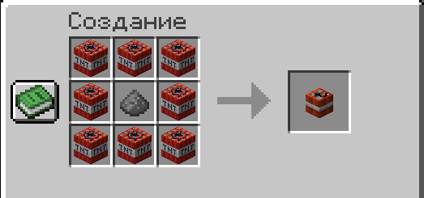

# 💣 Метательный динамит

Граната из TNT, которую можно бросить рукой. Отскакивает от стен и взрывается спустя несколько секунд.

***

### Крафт

<figure><figcaption></figcaption></figure>

***

### Использование

Нажми `Q` (выбросить) держа динамит в руке — он полетит в направлении взгляда.

* Отскакивает от стен, пола и потолка
* Взрывается через несколько секунд после броска
* Кулдаун между бросками: **0.5 сек**


Динамит нельзя поставить как блок — он работает только через бросок.

