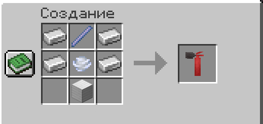

# 🧯 Огнетушитель

***

### Крафт

<figure><figcaption></figcaption></figure>


Носится в руке. Стакается только по 1 штуке.


***

### Зарядка

Огнетушитель работает на **зарядах ветра** (wind charge). Без зарядов использовать его нельзя.

Держа огнетушитель **в инвентаре** (не в руке):

| Действие | Результат                                  |
| -------- | ------------------------------------------ |
| `ПКМ`    | Зарядить **один** заряд ветра              |
| `ЛКМ`    | Зарядить **все** заряды ветра из инвентаря |

***

### Использование

#### 💨 Распыление пены — удерживать `ПКМ`

Зажми и удерживай `ПКМ` держа огнетушитель в руке.

Пока держишь — расходуются заряды ветра и летит пена:

* **Тушит огонь** на блоках
* **Активирует двери, люки** и другие интерактивные блоки рядом
* **Белит экран** игроку, в которого попала пена — обзор закрывается на несколько секунд

***

#### 🚀 прыжок — `ЛКМ` × (1–5) → `ПКМ`

1. **Нажимай `ЛКМ`** до 5 раз — огнетушитель взбалтывается, звук нарастает с каждым нажатием
2. **Нажми `ПКМ`** — выстрел отбрасывает тебя вверх и назад


Чем больше раз взболтал (до 5) — тем сильнее импульс прыжка.

