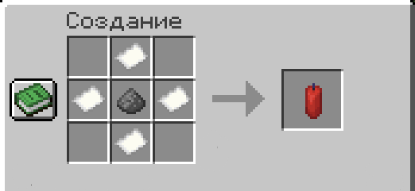

# 🧨 Петарда

Бросаемый предмет с физикой полёта. Летит по дуге, отскакивает от стен и взрывается с эффектами фейерверка.

***

### Крафт

<figure><figcaption></figcaption></figure>

***

### Использование

Нажми `ПКМ` держа петарду в руке — она полетит в направлении взгляда.

* Летит по дуге с учётом гравитации
* Отскакивает от стен, пола и потолка
* Взрывается через **5 секунд** после броска с эффектами фейерверка


Кулдаун между бросками: **1 секунда**.

