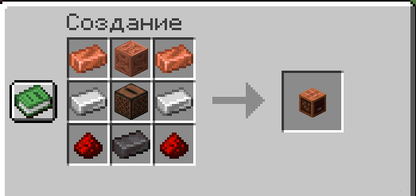

# 📻 Радио


Для работы радио необходим мод **Simple Voice Chat** на клиенте.


***

### Крафт

<figure><figcaption></figcaption></figure>

***

### Как пользоваться

#### 1. Поставь радио

Поставь блок радио в нужном месте. Рядом с ним игроки будут слышать и передавать звук в радиусе **15 блоков**.

#### 2. Выбери режим

`ПКМ` по радио переключает режим:

| Режим              | Что делает                                              |
| ------------------ | ------------------------------------------------------- |
| **Вход (Input)**   | Захватывает голоса игроков рядом и передаёт их на выход |
| **Выход (Output)** | Воспроизводит голос от входного радио игрокам рядом     |


Один игрок говорит рядом с **входным** радио → все слышат через **выходное** на той же частоте.


#### 3. Настрой частоту

Частота управляется только **сигналом красного камня** (1–15).

Только радиоблоки на **одинаковой частоте** связаны между собой. Используй разные частоты для разных команд или каналов.

***

### Антенна (дальность)

По умолчанию радио передаёт на **5 чанков** вокруг (чанк самого радио не считается).

Поставь **громоотводы** прямо над радио, чтобы увеличить дальность. Каждый громоотвод добавляет **5 чанков**:

| Громоотводов | Дальность |
| ------------ | --------- |
| 0            | 5 чанков  |
| 1            | 10 чанков |
| 2            | 15 чанков |
| 3            | 20 чанков |
| 4            | 25 чанков |
| 5            | 30 чанков |


Над радио **не должно быть полных блоков** — иначе передача не работает.


***

### Трансляция музыки

Поставь радио **прямо на музыкальный автомат** и вставь **кастомную пластинку** — музыка будет транслироваться на все выходные радио той же частоты.


Обычные ванильные пластинки не поддерживаются — только кастомные.


***

### Важно


Молния, попавшая в антенну, **навсегда уничтожает радио** — блок не выпадает. Прячь антенну или ставь молниеотводы рядом.

