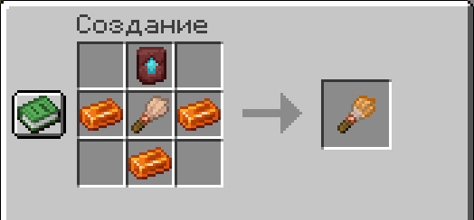

# ⛏️ Раскопки

### 🖌️ Улучшенная кисть

Копать можно только ей. Обычная кисть, лопата и руки не подойдут.

Собирается **на верстаке**:

<figure><figcaption></figcaption></figure>

Кисть **не ломается**.

***

### 🏖️ Где копать

<table><thead><tr><th width="320">Подходящие блоки</th><th>Условие</th></tr></thead><tbody><tr><td>Песок, красный песок, гравий, подозрительный песок и подозрительный гравий</td><td>Над блоком должно быть пусто</td></tr></tbody></table>


Биом значения не имеет — годится и пляж, и пустыня, и любая песчаная яма в пещере.


***

### ⏳ Как копать

**Присядь, наведись на блок и жми ПКМ кистью.** Дальше просто **держи SHIFT и не своди прицел** — пойдёт шорох и полетит песок.

Через **3–5 секунд** станет ясно, есть там что-то или нет. Время каждый раз разное, так что подгадать по счёту не выйдет.

Отпустил SHIFT, отвёл прицел, сменил предмет или отошёл — рытьё молча прекращается.


Раскопанный блок **помнит об этом 30 минут**. Долбить одну и ту же яму бессмысленно — иди вдоль берега.


***

### 🔍 Что попадается

**Что-то есть в 30% раскопанных блоков.** Из находок:

<table><thead><tr><th width="200">Находка</th><th width="140">Доля находок</th><th>Что это</th></tr></thead><tbody><tr><td>🪨 Пляжная мелочь</td><td>~72%</td><td>Кремень, кости, глина, стрелы, черепки, самородки, изредка изумруд или сердце моря</td></tr><tr><td>🎁 Кейс</td><td>~20%</td><td>Тот же кейс, что и с рыбалки</td></tr><tr><td>💣 Динамит</td><td>6%</td><td>Уже подожжён</td></tr><tr><td>🏺 Артефакт</td><td>~1,5%</td><td>Постоянный бонус, см. ниже</td></tr></tbody></table>


**Динамит.** Фитиль вдвое короче ванильного — примерно **полторы секунды**, отбежать почти нереально. Взрыв **не рушит блоки**, но бьёт больно. Постройки и ландшафт в безопасности, ты — нет.


Из песка попадаются и **мешочки монет** — 8–35 $ за штуку.

***

### 🎚️ Просев

Если что-то нашлось, находка начинает медленно подниматься из песка, а внизу появляется полоса. Пока идёт просев, **ты стоишь на месте** — двигаться нельзя.

По полосе сама собой ездит зелёная **платформа**. Ты управляешь **меткой**: она постоянно падает влево с ускорением, а пока зажат **SHIFT** — разгоняется вправо.

<table><thead><tr><th width="240">Где метка</th><th>Что происходит</th></tr></thead><tbody><tr><td>На платформе</td><td>Прогресс растёт, находка ползёт вверх</td></tr><tr><td>Мимо платформы</td><td>Прогресс стоит на месте</td></tr><tr><td>Упала на дно</td><td>Прогресс режется пополам</td></tr></tbody></table>

Заполнил полосу — находка твоя. А если прогресс уже настолько мал, что делить нечего, — находка уходит обратно в песок.


**Первые 3 секунды падение на дно ничем не наказывается** — есть время поймать инерцию.



Раскоп срывается, если отойти от ямы дальше **4 блоков** или выйти с сервера.


Полоса выглядит по-разному в зависимости от того, что копаешь: песок, красный песок, гравий или подозрительный блок.

***

### 🎁 Кейсы

Кейс — это голова, которую нужно вскрыть. Из песка кейс выпадает примерно в **6%** раскопанных блоков.

Те же кейсы поднимаются с рыбалки, см. страницу **Рыбалка**.

<table><thead><tr><th width="170">Редкость</th><th width="130">Предметов</th><th width="150">Среди кейсов</th><th>Шанс с одного раскопа</th></tr></thead><tbody><tr><td>⬜ Обычный</td><td>3</td><td>62%</td><td>3,8%</td></tr><tr><td>🟦 Редкий</td><td>4</td><td>27%</td><td>1,65%</td></tr><tr><td>🟪 Эпический</td><td>4</td><td>9%</td><td>0,55%</td></tr><tr><td>🟧 Легендарный</td><td>5</td><td>1,8%</td><td>0,11%</td></tr><tr><td>🟥 Мифический</td><td>5</td><td>0,2%</td><td>0,012%</td></tr></tbody></table>


Ценные кейсы из песка идут **заметно реже**, чем с рыбалки: мифический выкапывается примерно раз на 8000 блоков. Зато копать можно без ограничений по времени и без снаряжения.



Легендарный и мифический кейс объявляются **на весь сервер** — все увидят, кому повезло.


#### Как открыть

Возьми кейс в руку и нажми **ПКМ**. Откроется окно, предметы прокрутятся рулеткой и вскроются по одному.

Дальше на выбор:

* перетащить предметы к себе руками;
* просто **закрыть окно** — всё, что осталось, само уедет в инвентарь.


Инвентарь переполнен — лишнее выпадет под ноги. Вышел с сервера, не забрав лут, — он придёт при следующем входе.


Кейс расходуется при открытии. Поставить его блоком или надеть на голову нельзя.

#### Что внутри

Лут генерируется заново при каждом открытии, поэтому двух одинаковых кейсов не бывает. **В пределах одного кейса предметы не повторяются.**

<table><thead><tr><th width="170">Редкость</th><th>Примерное содержимое</th></tr></thead><tbody><tr><td>⬜ Обычный</td><td>Рыба, кости, нить, уголь, водоросли, самородки, мелкие монеты</td></tr><tr><td>🟦 Редкий</td><td>Слитки, лазурит, аметист, призмарин, бирки, сёдла, книги чар</td></tr><tr><td>🟪 Эпический</td><td>Алмазы, изумруды, жемчуг Края, осколки эха, сердце моря, зачарованное снаряжение, шаблоны кузнеца</td></tr><tr><td>🟧 Легендарный</td><td>Незеритовые обломки, тотем, проводник, трезубец, кирка глубин, шаблоны кузнеца</td></tr><tr><td>🟥 Мифический</td><td>Незеритовые слитки, звезда Нижнего мира, маяк, элитры, мейс, снаряжение с именами</td></tr></tbody></table>


В эпических и легендарных кейсах попадаются **шаблоны кузнеца из Тропных руин** — Вождь, Скульптор, Собиратель и Искатель. Тематика ровно та же, что и у раскопок.


***

### 💰 Мешочек монет

Попадается и в песке, и в кейсах любой редкости. На самом мешочке написана сумма — нажми **ПКМ**, и деньги зачислятся на счёт.

<table><thead><tr><th width="240">Откуда</th><th>Сумма</th></tr></thead><tbody><tr><td>⛏️ Прямо из песка</td><td>8–35 $</td></tr><tr><td>⬜ Обычный кейс</td><td>13–53 $</td></tr><tr><td>🟦 Редкий кейс</td><td>40–100 $</td></tr><tr><td>🟪 Эпический кейс</td><td>80–173 $</td></tr><tr><td>🟧 Легендарный кейс</td><td>133–253 $</td></tr><tr><td>🟥 Мифический кейс</td><td>200–333 $</td></tr></tbody></table>

***

### ✨ Особые чары

Начиная с **редкого** кейса в снаряжении и книгах попадаются серверные чары — те, которых нет в ванилле.

<table><thead><tr><th width="200">Редкость кейса</th><th width="200">Шанс особых чар</th><th>Сколько максимум</th></tr></thead><tbody><tr><td>🟦 Редкий</td><td>15%</td><td>1</td></tr><tr><td>🟪 Эпический</td><td>30%</td><td>1</td></tr><tr><td>🟧 Легендарный</td><td>45%</td><td>2</td></tr><tr><td>🟥 Мифический</td><td>60%</td><td>2</td></tr></tbody></table>


Проклятия из кейсов **не выпадают** — только полезные чары.


***

### 🏺 Артефакты

Предметы с постоянными эффектами. Артефакт **достаточно держать в инвентаре** — надевать или брать в руку не нужно. Эффекты **складываются**.

<table><thead><tr><th width="240">Источник</th><th>Шанс артефакта</th></tr></thead><tbody><tr><td>⛏️ Раскопки</td><td>1,5% от находок</td></tr><tr><td>🟧 Легендарный кейс</td><td>1%</td></tr><tr><td>🟥 Мифический кейс</td><td>26%</td></tr></tbody></table>

Из кейса артефакт приходит **вместо одного из предметов**, а не сверх них.

#### Работают на раскопках

<table><thead><tr><th width="240">Артефакт</th><th>Что делает</th></tr></thead><tbody><tr><td>Песчаная линза</td><td>В песке что-то находится на 10% чаще</td></tr><tr><td>Обрывок карты</td><td>Кейсы попадаются в песке на 5% чаще</td></tr><tr><td>Гулкий камень</td><td>Рыть песок получается на треть быстрее</td></tr><tr><td>Каменное сердце</td><td>Находка выкапывается на треть быстрее</td></tr><tr><td>Храмовая печать</td><td>Перерытый песок можно копать снова вдвое раньше</td></tr><tr><td>Кремнёвый наконечник</td><td>Обычные находки из песка выкапываются двойной пачкой</td></tr><tr><td>Песчаный клинок</td><td>На раскопках метка падает медленнее — удержать её легче</td></tr><tr><td>Тяжёлый браслет</td><td>Платформа на раскопках ездит спокойнее и реже виляет</td></tr><tr><td>Каменное копыто</td><td>Раскоп не срывается, даже если отойти от ямы</td></tr><tr><td>Дыхательное ядро</td><td>Выкопанный динамит гаснет и не взрывается</td></tr><tr><td>Огнеупорная чешуя</td><td>Взрыв динамита бьёт вдвое слабее</td></tr></tbody></table>

#### Работают везде

<table><thead><tr><th width="240">Артефакт</th><th>Что делает</th></tr></thead><tbody><tr><td>Обсидиановый ключ</td><td>В каждом кейсе оказывается на один предмет больше</td></tr><tr><td>Старая шифровка</td><td>Артефакты попадаются в кейсах на 5% чаще</td></tr><tr><td>Торговый жетон</td><td>В мешочках монет оказывается на четверть больше денег</td></tr><tr><td>Потемневшая монета</td><td>В мешочках монет на 15% больше денег</td></tr><tr><td>Дымное кадило</td><td>За улов и находки даётся в полтора раза больше опыта</td></tr></tbody></table>

***

### 📋 Команды

<table><thead><tr><th width="220">Команда</th><th>Описание</th></tr></thead><tbody><tr><td><code>/dig</code></td><td>Твоя статистика: раскопано, найдено, сорвалось, вскрытые кейсы</td></tr><tr><td><code>/dig top</code></td><td>Топ-10 копателей сервера</td></tr><tr><td><code>/dig info</code></td><td>Правила просева и актуальные шансы находок</td></tr></tbody></table>

Вместо `/dig` можно писать `/digging` или `/раскопки`.


Топы **раздельные**. Рыбалка и раскопки — разные промыслы, и рекорды в них не смешиваются.


***

### 💡 Коротко

* Копать можно только **улучшенной кистью** — крафт на верстаке.
* **Присядь, наведись, ПКМ** — и держи SHIFT 3–5 секунд.
* В просеве платформа ездит сама, метку **поднимает SHIFT**.
* Падение метки на дно **режет прогресс пополам**, первые 3 секунды не в счёт.
* Одну и ту же яму копать бессмысленно: песок помнит раскоп **30 минут**.
* Динамит **не рушит блоки**, но бьёт больно — фитиль всего полторы секунды.
